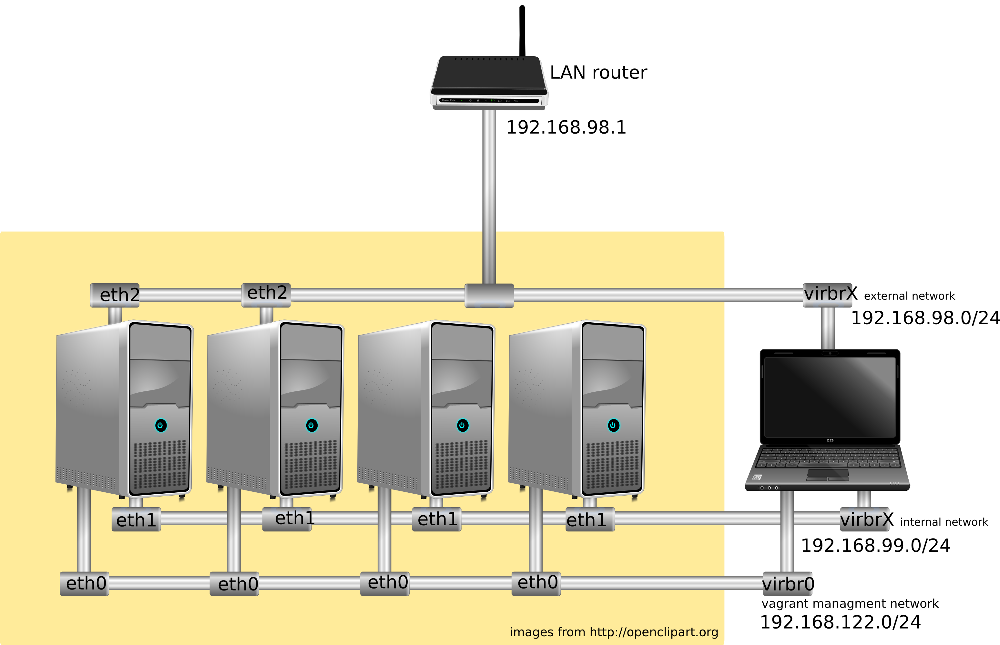

# openstack-debian-ansible


Playbooks ansible para la instalación de OpenStack Wallaby sobre Debian 11 Bullseye usando los repositorios backports que encontramos en [Openstack Debian wiki](https://wiki.debian.org/OpenStack).

Se ha seguido los pasos de la instalación base que se presenta en: [OpenStack Wallaby Installation Guide](https://docs.openstack.org/wallaby/install/) con algunas modificaciones por el uso de Debian.

La opción de red usada es "Self-service networks" usando linux bridges: [Linux bridge: Self-service networks](https://docs.openstack.org/mitaka/networking-guide/deploy-lb-selfservice.html).

Estos playbook están escritos para usarlos en el despliegue real de Openstack en servidores físicos, pero se pueden usar para desplegar en entornos de prueba con:

* Vagrant using vagrant-libvirt plugin.
* OpenStack Heat
* Proxmox

## Software usado:

- Debian GNU/Linux: bullseye (amd64). 
- Linux kernel: 5.10.0-13-amd64
- OpenStack: Wallaby
- Ansible: 2.10.8
- Vagrant: 2.2.14
- vagrant-libvirt: 0.3.0
- qemu-kvm: 1:5.2++dfsg-11+deb11u1

## Componentes de OpenStack incluidos:

Keystone, Glance, Placement, Nova, Neutron, Horizon, Cinder and Heat

## Instalación con vagrant



### Configuración inicial

Levantamos el escenario:

	vagrant up

Como el nodo controlador hace también de nodo de red, hemos añadido una interfaz (`eth2`) que siguiendo las instrucciones de la [documentación](https://docs.openstack.org/install-guide/environment-networking-controller.html), vamos a configurar de la siguiente manera:

    vagrant ssh controller
    nano /etc/network/interfaces

Y configuramos la interfaz `eth2` de la siguiente manera:

```
auto eth2
iface eth2 inet manual
up ip link set dev $IFACE up
down ip link set dev $IFACE down
```

Y reiniciamos la interface:

```
ifdown eth2
ifup eth2
```


### Configuración de ansible

En el fichero `groups_var/all` se indicanm las variables usadas por el playbook, se pueden modificar para que se adapten a las necesidades. En nuestro caso:

* `controller_fqdn`: Nombre por el que se puede acceder si queremos usar resolución estática.
* `external_interface: "eth2"`: Interface del controlador.que se va a usar cómo entrada de las instancias.
* `cinder_physical_device: vdb`: Dispositivo de bloque que se usa en cinder. En nuestro caso el disco que se ha añadido al nodo controlador.

## Ejecución de ansible

    ansible-playbook site.yml

## Comprobación del funcionamiento

Desde el controlador vamos a subir una imagen de prueba:

```
source admin_openrc.sh
wget http://download.cirros-cloud.net/0.5.1/cirros-0.5.1-x86_64-disk.img
openstack image create --public --container-format=bare --disk-format=qcow2 \
 --file cirros-0.5.1-x86_64-disk.img "Cirros 0.5.1"
```

Creamos un "flavor" de prueba:

```
openstack flavor create m1.tiny --id 1 \
    --ram 512 --disk 1 --vcpus 1
```

A continuación vamos a crear la red externa:

```
openstack network create  --external \
  --provider-physical-network provider \
  --provider-network-type flat ext-net

openstack subnet create --network ext-net \
  --allocation-pool start=192.168.98.200,end=192.168.98.254 \
  --dns-nameserver 1.1.1.1 --gateway 192.168.98.1 \
  --subnet-range 192.168.98.0/24 ext-subnet
```

El usuario demo va a crear su red interna y su router:

```
source demo_openrc.sh
openstack network create red_demo
openstack subnet create --network red_demo --subnet-range 10.0.0.0/24 subred_demo

openstack router create router_demo
openstack router set router_demo --external-gateway ext-net
openstack router add subnet router_demo subred_demo
```

Y va a abrir el puerto 22 en el grupo de seguridad `default`:

```
openstack security group rule create --protocol tcp --remote-ip 0.0.0.0/0 --dst-port 22 default
```

Y ya puede crear una instancia:

```
openstack server create --flavor m1.tiny \
 --image "Cirros 0.5.1" \
 --security-group default \
 --network "red_demo" \
 instancia_prueba
 ```


Y obtenemos una ip flotante y la asignamos a la instancia:

```
openstack floating ip create ext-net
openstack server add floating ip instancia_prueba 192.168.98.203
```

Y desde nuestro ordenador podemos acceder por ssh:

```
ssh cirros@192.168.98.203
The authenticity of host '192.168.98.203 (192.168.98.203)' can't be established.
ECDSA key fingerprint is SHA256:iNC3IMeMwoNJG3Q+LBQy5AbTNWFym+PfcHTq0mBDttI.
Are you sure you want to continue connecting (yes/no/[fingerprint])? yes
Warning: Permanently added '192.168.98.203' (ECDSA) to the list of known hosts.
cirros@192.168.98.203's password: 
$ 
```

## Acceso a horizon

Tienes que acceder a la URL `https://192.168.98.101`:


## Volúmenes

El usuario demo crea un volumen y lo asocia a la instancia:

```
openstack volume create --size 1 mi_disco1
openstack server add volume --device /dev/sdb instancia_prueba mi_disco1
```

Desde la instancia comprobamos que se ha asociado:

```
$ lsblk
NAME    MAJ:MIN RM  SIZE RO TYPE MOUNTPOINT
...
vdb     252:16   0    1G  0 disk 
```

